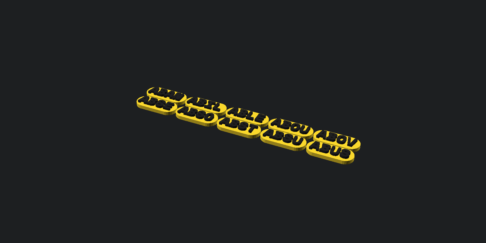
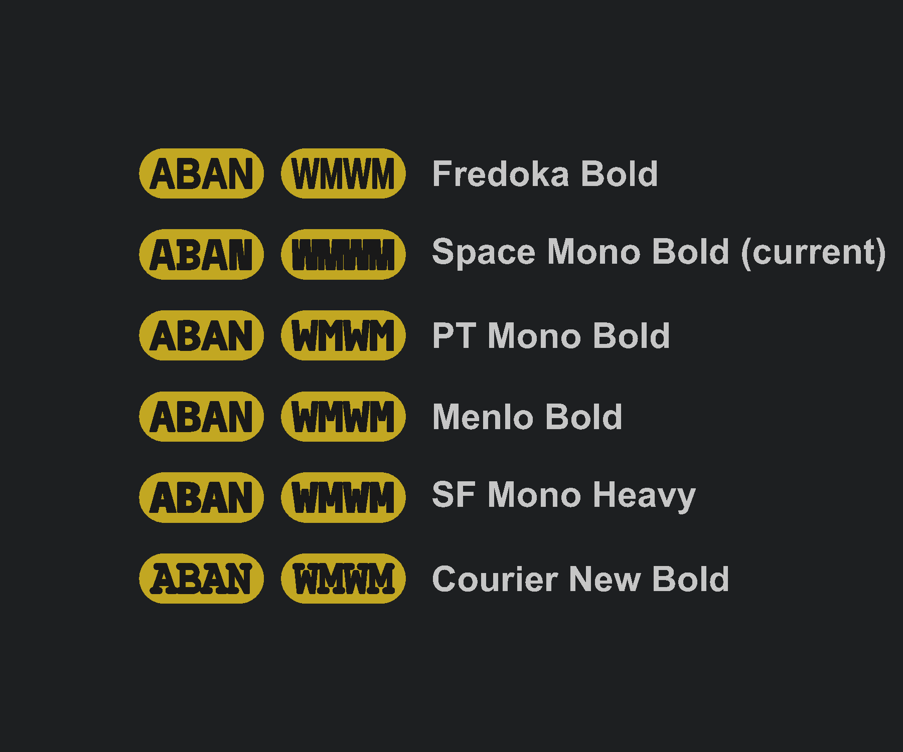
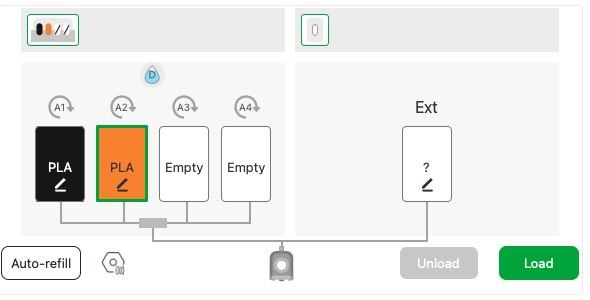
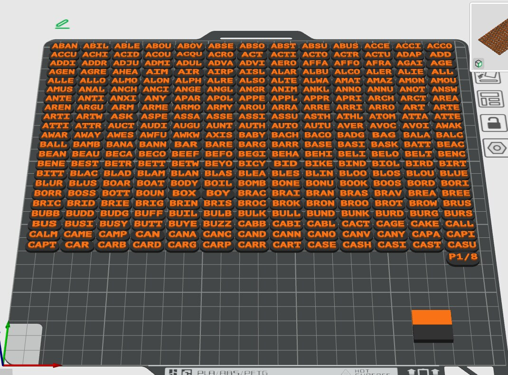
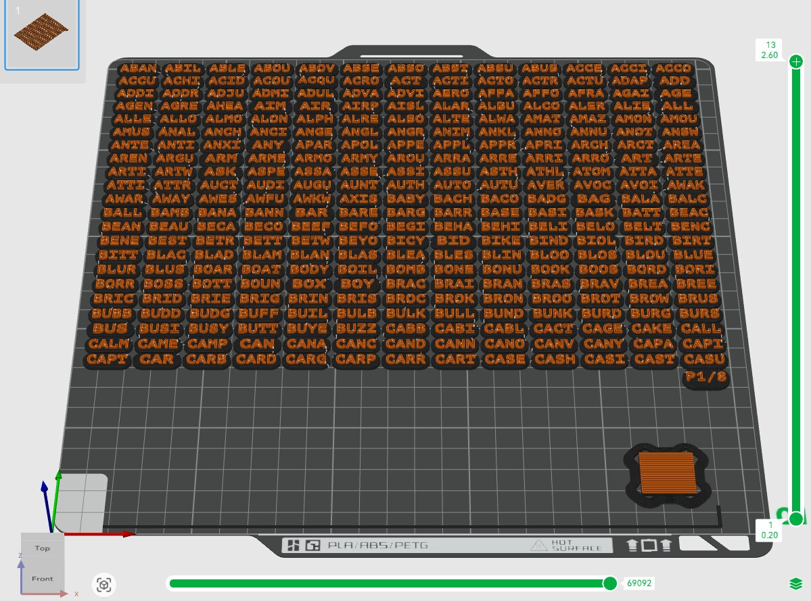
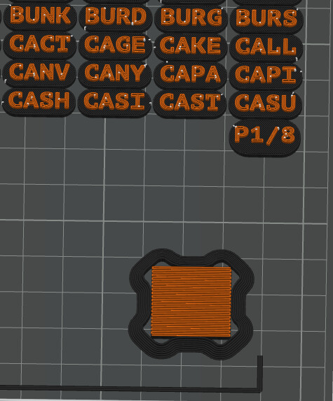
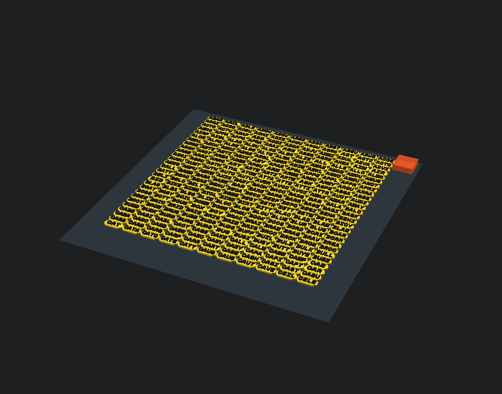
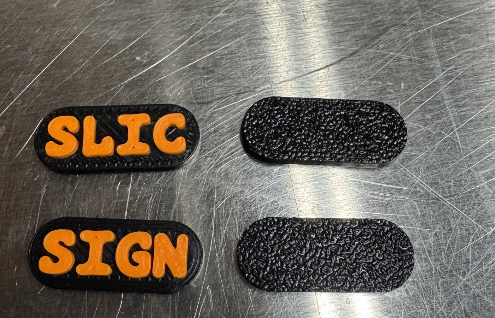
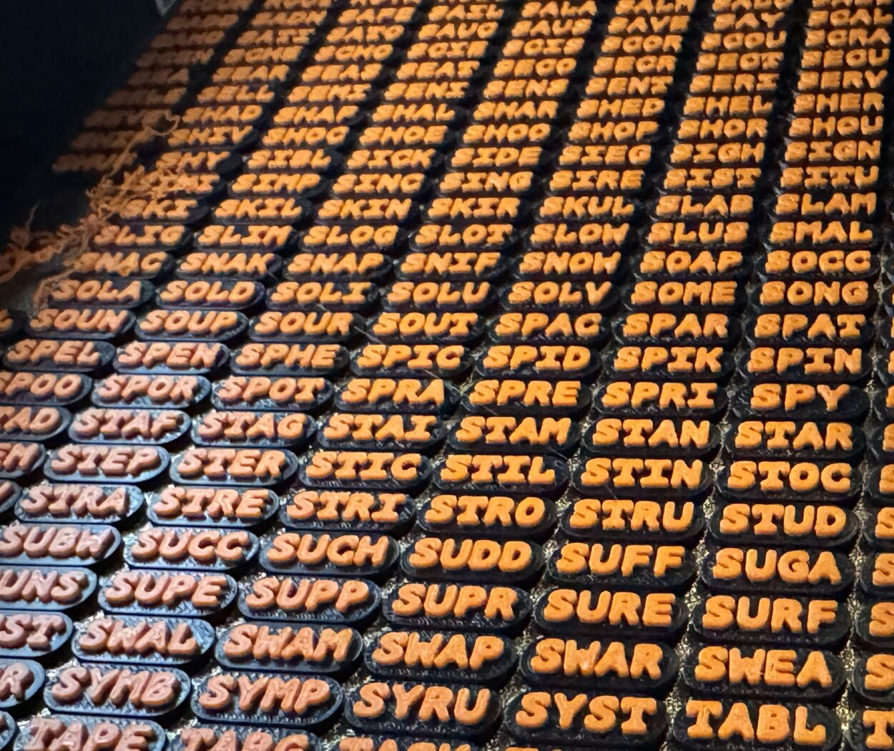

# SeedPills

**Current version: `0.2.0-beta.9`**

Create a printable set of 2,048 BIP39 word tiles for seed-phrase games,
demonstrations, and offline random selection.



Each pill is a thin, standalone tile with bold raised text designed around a
0.4 mm nozzle. The first four letters identify every BIP39 English word
uniquely. Shorter words use all their letters.


The two-color split is what makes the letters pop: the base part prints in one
filament and the raised text in another, so the word is legible without any
painting or inking.

> [!CAUTION]
> Treat a selected seed phrase like a password. Do not photograph it, upload
> it, or use an unverified selection process to secure real funds.

## Drawing a seed phrase

SeedPills are a physical, offline random word source. Each of the 2,048 BIP39
English words is printed on exactly one pill, so the full set is a fair deck of
all possible words. To generate a phrase:

1. **Shuffle the deck.** Mix all 2,048 pills thoroughly—shake them in a bag,
   box, or hat. Because every word appears exactly once, a good shuffle gives
   each word an equal chance.
2. **Draw the entropy words.** Reach in blind (or let someone else draw) and
   pull out pills, one at a time, in order. Draw **11 words for a 12-word
   phrase** or **23 words for a 24-word phrase**. After each draw, **return
   the pill to the deck and reshuffle** so that every draw is an independent,
   uniform choice over all 2,048 words (with replacement).
3. **Compute the checksum word.** The final word of a BIP39 phrase is a
   checksum, not entropy. Do **not** draw it from the pills. Enter the words
   you drew into a hardware wallet such as a SeedSigner (or any device that
   builds BIP39 seeds offline) and let it append the correct checksum word.
   Drawing a random 12th or 24th word would produce an invalid phrase that no
   wallet will accept.
4. **Record and verify.** Write down the full phrase, checksum word included,
   in the order given. Because the pills only hold the first four letters of
   each word (or the whole word when it is shorter), you still need the full
   BIP39 wordlist to expand an abbreviation back to the canonical word—see
   "Why four letters" below.

> [!IMPORTANT]
> The pills provide the **entropy** only. The checksum word is derived from
> that entropy by a BIP39 implementation and must come from a trusted device
> (e.g. a SeedSigner), never from the deck. The pills are also an **input** to
> a seed phrase, not the secret itself: anyone who can see the drawn words in
> order can reconstruct your funds. Draw in private, keep the written list
> secure, and never photograph or upload the result.

### Why four letters are enough

The BIP39 English wordlist has the property that no two words share the same
first four letters. That means a pill labelled `ABAN`, `ABST`, or `ABUS`
unambiguously maps back to exactly one full word (`abandon`, `about`, `abuse`,
…). For words shorter than four letters, the pill prints the entire word. So
the compact pill text is lossless: you can always recover the exact BIP39 word
from what is printed.

## Design highlights

- Separate base and text meshes for two-color printing
- Vendor-neutral STL output; no slicer-specific project format required
- Clean individual pills without breakaway-link scars
- 2.6 mm total thickness: 1.6 mm base plus 1.0 mm raised text
- PT Mono Bold lettering expanded by 0.12 mm and fitted from its glyph
  outlines for large type that stays clear of the rounded pill edges
- 0.4 mm gaps between pills—close together without shared geometry
- Dedicated 20 mm strip for an approximately 20 × 20 mm prime tower
- Automatic two-color `P1/8` through `P8/8` plate-identification tiles
- Automatic P1S/X1C bed layout with configurable dimensions

## Quick start

Requirements:

- [OpenSCAD](https://openscad.org/)
- [PT Mono](https://fonts.google.com/specimen/PT+Mono), installed with the
  Bold style
- Python 3 only if you want to render batches automatically

### Font palette

PT Mono Bold is the current production font. This palette compares it with
other installed bold faces using the real pill dimensions, 0.12 mm glyph
expansion, geometry-aware fitting, and 1.0 mm text extrusion. `WMWM` stresses
the widest letter combination.



| Font | Tradeoff |
|---|---|
| Space Mono Bold | Open, geometric, and heavier than PT Mono |
| PT Mono Bold | Current choice; compact, clear, and monospaced |
| Menlo Bold | Crisp and compact, but primarily available on Apple systems |
| SF Mono Heavy | Very thick strokes, but Apple-specific |
| Courier New Bold | Widely available with a more traditional appearance |
| Fredoka Bold | Rounded and highly printable, but not monospaced |

For reproducible output on another machine, install the exact chosen font or
change the `font` variable in `seeds.scad`.

To inspect or export directly:

1. Open `seeds.scad` in OpenSCAD.
2. Set `first` to the zero-based index of the first word (`0` starts with
   `ABAN`). The production defaults are `columns = 13` and `rows = 22`.
   Set either value to `0` to auto-fit that dimension from the bed.
3. Set `render_part` to `"base"` and export an STL.
4. Set `render_part` to `"text"` and export a second STL with the same grid
   settings.

For the complete word list, use the batch renderer:

```sh
python3 render_batches.py
```

This produces eight matching base/text pairs in `stl_files/`. Generated STL
and 3MF files are ignored by Git and are never intended to be committed.

On macOS, the preferred print-preparation command regenerates **all eight
plates** in a fresh temporary folder and opens the requested plate in Bambu
Studio together with the version-matched repo preset:

```sh
python3 render_batches.py --open-bambu 1
```

That example opens `P1/8`. The files
remain outside the repository and can be discarded after slicing. The launch
builds a temporary Bambu-native 3MF from the vendor-neutral STLs, then verifies
that it uses the 256 × 256 mm P1S bed, clears the exclusion zone, keeps the
prime tower separate, and assigns filament 1 (black) to the base and filament 2
(orange) to the raised text. Only that validated temporary project is opened.

Before slicing, set or confirm the physical AMS colors under **Device**: A1 is
black and A2 is orange. Return to **Prepare** and use **Sync info** if the
project filament colors do not match the device.



The ready-to-slice result should show black pill bases, orange lettering, the
`P1/8` marker, and a two-color prime tower in the open lower band:



After **Slice plate**, check **Preview** before sending the job. The sliced
plate should still show orange text over black bases, the `P1/8` marker, and a
two-color prime tower. Seeing all four confirms that the multipart assignments
survived slicing and that the tower fits in the reserved lower band:



The close-up below shows the expected sliced toolpaths for the plate marker and
prime tower. The orange center confirms that both filaments are represented in
the tower rather than merely colored in the Prepare view:



## Two-color slicer workflow

For each plate, select the matching `_base.stl` and `_text.stl` files and
import them **at the same time**. When the slicer asks, load them as one object
with multiple parts. Do not auto-arrange the two parts separately; their shared
coordinates provide the alignment.

Then assign one filament or extruder to the base part and another to the text
part. This workflow works with Bambu Studio, OrcaSlicer, PrusaSlicer, and other
slicers that support multipart models.

Example pair:

```text
SeedPills_single_13x22_0001_0286_base.stl
SeedPills_single_13x22_0001_0286_text.stl
```

## Default plate layout



The defaults target a 256 × 256 mm Bambu P1S/X1C build plate:

| Setting | Default | Purpose |
|---|---:|---|
| Grid | 13 × 22 | 286 pills on each full plate |
| Pill size | 18.5 × 7.5 mm | Compact, easy-to-handle tile |
| Pill gap | 0.4 mm | One nozzle width, with no shared geometry |
| Bed margin | 4 mm | Clearance for skirt or brim |
| Front-left exclusion | 18 × 28 mm | Cutter/wiper clearance |
| Prime-tower reserve | 20 mm wide | Clear strip at the right edge |

The complete 2,048-word single-sided set occupies eight plates. Unused slots
on the last plate are left blank.

The `prime_tower` setting is `[20, 20]`. The current rectangular grid reserves
its 20 mm width as a full-height strip, which is conservative and lets the
slicer place the tower along that edge. A small standalone plate-ID tile sits
directly below the grid's bottom-right pill with the same 0.4 mm clearance as
the pills. The wide, short grid leaves a lower band for that tile and the prime
tower. The batch renderer numbers the tile automatically (`P1/8`, `P2/8`, and
so on), making it easy to keep pills associated with their source plate.

## Print settings

Recommended starting point for PLA or PETG:

| Setting | Recommendation |
|---|---|
| Nozzle | 0.4 mm |
| Layer height | 0.2 mm |
| Line width | 0.45–0.5 mm |
| Walls | 3 |
| Supports | None |

The base is eight 0.2 mm layers and the text is five more layers. If adhesion
is marginal, use a small per-object brim. A shared brim can join neighboring
pills and leave rough edges.

### Bambu Studio preset

An importable P1S/0.4 mm process preset is included at
[`presets/SeedPills 0.20mm @BBL P1S.json`](presets/SeedPills%200.20mm%20@BBL%20P1S.json).
In Bambu Studio, use **File → Import → Import Configs**, select the JSON file,
then choose **SeedPills 0.2.0-beta.9 — 0.20mm @BBL P1S** as the process preset.
The version in that visible profile name should match the version shown at the
top of this README and in [`VERSION`](VERSION).

The preset inherits Bambu's P1S-compatible 0.20 mm standard profile and
overrides the settings important to this model:

- 0.20 mm layers and 0.45 mm walls
- 3 Arachne wall loops for the compact PT Mono glyphs
- 4 bottom plus 4 top shell layers, making the 1.6 mm base solid
- Conservative speeds throughout: 20 mm/s first layers, 45 mm/s outer/top
  surfaces, 70 mm/s inner/solid/infill moves, and 200 mm/s travel
- Reduced print and travel accelerations for steadier small-feature motion
- 0.15 mm elephant-foot compensation to preserve the 0.4 mm pill gaps
- Supports, ironing, and brims disabled
- A 20 mm prime tower with no added brim, matching the reserved right strip
- Prime-tower position fixed at X=210, Y=4 in the open lower-right band
- Sparse prime-tower layers enabled, avoiding Bambu's relative-position
  restriction on this nearly full-bed layout

The `--open-bambu` workflow imports the paired STLs as one multipart object,
assigns the base to filament 1 (black) and text to filament 2 (orange), and
loads this preset. Bambu Studio automatically arranges the assembled object
around the P1S exclusion zones while retaining the base/text alignment. No
manual model, color assignment, or tower movement should be needed. Always
inspect the sliced preview before printing, especially after changing printer,
bed, filament type, or tower dimensions.

## Real print results and troubleshooting



The raised PT Mono lettering remains readable at the small tile size, and the
textured plate finish transfers cleanly to the flat backs.

### Localized adhesion failure



The failure above is localized while the surrounding pills printed normally.
That pattern most strongly suggests that one or more tiles lifted or detached,
after which the nozzle caught them and dragged loose filament across nearby
parts. It does not look like a plate-wide flow or temperature failure.

Before reprinting a failed plate:

1. Wash the build plate with warm water and plain dish soap, then avoid touching
   the print area.
2. For PLA on an enclosed P1S, disable or substantially reduce the auxiliary
   fan; its side airflow can cool one region of a broad, thin print unevenly.
3. Confirm the selected build-plate type and watch the first two layers for a
   lifting edge before committing to the full plate.
4. If failure repeats in exactly the same location, rotate or swap the build
   plate to distinguish a surface problem from directional cooling.

A brim is intentionally not enabled by default because it can join these
closely spaced pills and recreate the rough edges this design avoids.

## Batch-rendering options

```sh
python3 render_batches.py                     # all plates, paired STLs
python3 render_batches.py --first 286 --count 1
python3 render_batches.py --open-bambu 1          # regenerate all; open P1/8
python3 render_batches.py --columns 8 --rows 16
python3 render_batches.py --bed 256,256
python3 render_batches.py --double-sided
python3 render_batches.py --format 3mf        # multipart standard 3MF files
python3 render_batches.py --out another_folder
```

On macOS, the script finds the OpenSCAD application bundle automatically.
Elsewhere, put `openscad` on `PATH` or pass `--openscad /path/to/openscad`.

Output names follow this pattern:

```text
SeedPills_<sides>_<columns>x<rows>_<first>-<last>_<part>.stl
SeedPills_<sides>_<columns>x<rows>_<first>-<last>.3mf
```

STL output uses matching base/text files because STL has no multipart
container. Each 3MF contains both meshes as aligned components with their base
and text colors, ready for filament assignment without manual positioning.

## Useful parameters

Edit these near the top of `seeds.scad`:

| Parameter | Meaning |
|---|---|
| `first` | Zero-based first word index |
| `columns`, `rows` | Grid dimensions; `0` enables automatic sizing |
| `bed` | Build-plate width and depth in millimeters |
| `prime_tower` | Requested tower footprint in millimeters |
| `show_plate_id` | Include the standalone plate-number tile |
| `plate_number`, `plate_count` | Plate label values; batch rendering sets them |
| `spacing` | Gap between neighboring pills |
| `render_part` | `"both"`, `"base"`, or `"text"` |
| `connected` | Add optional breakaway links |
| `double_sided` | Put the upper 1,024 words on the reverse side |
| `font`, `font_size` | Typeface and letter height |
| `text_weight` | Outward glyph expansion |
| `text_box_width`, `text_box_height` | Safe fitted lettering area |

The source of truth is [seeds.scad](seeds.scad). `render_batches.py` is only
an automation helper: it queries OpenSCAD for the effective grid before it
renders any batches, so layout dimensions are never duplicated in Python.

To verify that every pill still matches the canonical BIP39 English wordlist:

```sh
python3 test_words.py
```
